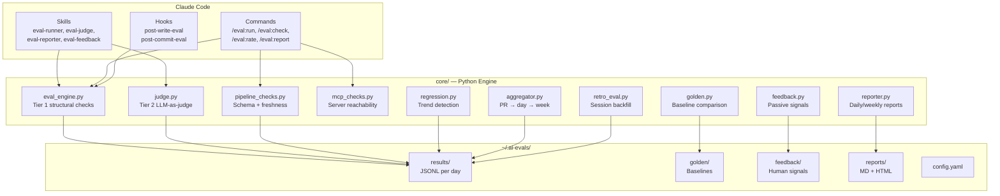

# AI Thinking Partner Evals Framework

Continuous evaluation for AI agent ecosystems. Tracks output quality across structured documents, reasoning, data analysis, code generation, search retrieval, data pipelines, and MCP reliability — using automated checks, LLM-as-judge rubrics, and passive human feedback.

Built for power users running Claude Code, Cursor, or similar AI coding assistants who want to measure and improve the quality of AI-generated work over time.

## Quick Install

```bash
git clone https://github.com/ahmedkhaledmohamed/ai-thinking-partner-evals-framework.git
cd ai-thinking-partner-evals-framework
node plugin/bin/install.js
```

The installer detects your runtime (Claude Code / Cursor), creates `~/.ai-evals/` with default config, and copies skills + commands + hooks.

## What It Looks Like

### Daily Quality Report

```
APQS: 0.827 (GREEN) — 106 evals across 5 categories

Category            Evals   Avg Score   Status
structured_doc         90       0.84    GREEN
open_reasoning          6       0.84    GREEN
code_technical          7       0.71    YELLOW
data_analysis           1       0.65    YELLOW
pipeline                2       0.64    YELLOW

Best:  session-state-may28-final.md — scored 1.00
Worst: inapp-effectiveness-summary.md — scored 0.55
```

### LLM-as-Judge Scorecard

When you run `/eval:check <file>`, the framework sends the document to a separate Claude instance with a scoring rubric:

```
Eval Scorecard: ws1-surface-analysis.md

Dimension              Score   Status
completeness            0.92   GREEN
evidence_grounding      0.85   GREEN
audience_calibration    0.80   GREEN
actionability           0.72   YELLOW
intellectual_honesty    0.70   YELLOW
────────────────────────────────────────
Overall                 0.72   YELLOW

Weaknesses:
 - Analysis identifies new surface work needed but stops short of
   naming owners or specifying estimated effort
 - Impression cap data cited without source attribution
 - 6 of 11 interventions appear only in summary matrix with no
   individual analysis — no rationale for the omission
```

### Pipeline Integrity Checks

```
Pipeline: orchestration-dashboard — 10/16 checks passed

Check           Status   Value              Threshold
directory       OK       public/data/       -
channel-health  OK       valid JSON         -
freshness       CRIT     1981h old          <24h
categories.json CRIT     MISSING            -
collision.json  CRIT     MISSING            -
operators       OK       valid JSON         -
null_check      OK       0 nulls            -
```

### MCP Server Reliability

```
MCP Reliability — 16/16 reachable, avg 72ms

Server                         Status   Latency
aika-search                    OK       64ms
bigquery-mcp                   OK       58ms
code-search                    OK       71ms
groove-mcp                     OK       83ms
slack-mcp                      OK       67ms
the-hub (stdio)                OK       local
...

Known Quirks:
 - groove-mcp: additionalOrgs field may be absent in
   get-definition-of-done responses
 - code-search: uppercase OR treated as literal, use | instead
```

### Conversation Quality (Retroactive)

The `retro_eval` module scans past Claude Code sessions and scores conversation quality:

```
Session 5edd8146 (Jun 9, 15 turns)

Dimension              Score
non_sycophancy          0.95   No sycophantic openers detected
response_depth          0.82   Avg 280 words per substantive block
low_correction_rate     0.90   1 correction in 8 human turns
specificity             0.88   High density of file paths, metrics, names
tool_grounding          0.76   12 tool calls across 15 turns
────────────────────────────────────────
Overall                 0.86   GREEN
```

## Core Concepts

### Three-Tier Evaluation

| Tier | Method | Speed | When |
|------|--------|-------|------|
| **1** | Structural checks | <1s | Every write (automated via hooks) |
| **2** | LLM-as-judge | ~10s | On demand via `/eval:check` |
| **3** | Human feedback | Passive | Commit signals, edit distance, explicit ratings |

### Seven Categories

| Category | What It Measures |
|----------|-----------------|
| `structured_doc` | Product briefs, updates, meeting prep — section completeness + quality |
| `open_reasoning` | Thought-partner, devil-advocate — argument depth + intellectual honesty |
| `data_analysis` | SQL queries, metric interpretation — correctness + caveats |
| `code_technical` | Generated code, prototypes — functionality + pattern conformance |
| `search_retrieval` | Search relevance — citation accuracy + completeness |
| `pipeline` | Data pipeline integrity — schema, freshness, row counts, nulls |
| `mcp_reliability` | MCP server connectivity — uptime, latency, known quirks |

### APQS (AI Product Quality Score)

A weighted composite (0.0-1.0) across all categories:

```
APQS = 0.20 * structured_docs
     + 0.15 * reasoning
     + 0.15 * data_analytics
     + 0.15 * code_technical
     + 0.10 * search_retrieval
     + 0.10 * pipelines
     + 0.15 * mcp_reliability
```

Traffic lights: **GREEN** (>= 0.8) | **YELLOW** (0.6-0.8) | **RED** (< 0.6)

## Available Commands

| Command | Description |
|---------|-------------|
| `/eval:run [category\|all]` | Run evaluations across categories |
| `/eval:check <file>` | Quick quality check — Tier 1 + LLM judge |
| `/eval:rate [pr\|day\|week]` | Multi-level quality rating |
| `/eval:report [daily\|weekly\|trend]` | Generate quality reports |
| `/eval:pipeline [name\|all]` | Run pipeline integrity checks |
| `/eval:regression` | Detect and investigate quality regressions |
| `/eval:calibrate` | Compare human ratings to judge scores |

## Architecture



## Data Flow

```mermaid
flowchart LR
    A[You write a .md file] --> B[PostToolUse hook fires]
    B --> C[Tier 1: structural check]
    C --> D[Score appended to JSONL]
    D --> E[/eval:rate day]
    E --> F[Daily APQS report]
    
    G[You run /eval:check] --> H[Tier 1 + Tier 2]
    H --> I[LLM judge scores<br/>against rubric]
    I --> D
    
    J[You commit code] --> K[PostCommit hook]
    K --> L[PR-level eval]
    L --> D
```

## Data Storage

All data lives in `~/.ai-evals/` — no database, no external service:

| Directory | Format | Contents |
|-----------|--------|----------|
| `results/` | JSONL | One file per day: `2026-06-16.jsonl` |
| `golden/` | JSON | Golden baselines for regression comparison |
| `feedback/` | JSONL | Human feedback signals |
| `reports/` | MD + HTML | Generated reports and dashboard |
| `config.yaml` | YAML | User configuration overrides |
| `baselines.json` | JSON | Computed 30-day rolling baselines |

## LLM-as-Judge Rubrics

Rubrics live in `plugin/rubrics/` as markdown files. Each defines dimensions with weights that must sum to 1.0:

```markdown
## Completeness (weight: 0.25)
- 1.0: All required sections present with substantive content
- 0.7: Most sections present, 1-2 are thin
- 0.4: Several required sections missing
- 0.0: Fundamentally incomplete

## Evidence Grounding (weight: 0.25)
- 1.0: Every claim backed by data or citation
- 0.7: Key claims grounded, some unsupported
- 0.0: No grounding — generic template filler

## Anti-Patterns (penalize by 0.1 each)
- Sycophantic opening ("great question", "excellent approach")
- Motivational language instead of factual
- Claims without evidence that could have been provided
```

Five rubrics are included: `structured-doc`, `open-reasoning`, `data-analysis`, `code-technical`, `search-retrieval`. Write your own following the same pattern.

## Retroactive Evaluation

Already have weeks of Claude Code sessions? Backfill your baselines:

```bash
# Dry run — see what would be evaluated
python3 -m core.retro_eval --dry-run

# Run for real — writes to ~/.ai-evals/results/ with original timestamps
python3 -m core.retro_eval
```

This scans session transcripts in `~/.claude/projects/`, extracts written artifacts and conversation quality signals, and runs Tier 1 evals. Deduplicates automatically on re-run.

## Configuration

Override defaults in `~/.ai-evals/config.yaml`:

```yaml
# Change the judge model
judge_model: claude-sonnet-4-6

# Adjust regression sensitivity
thresholds:
  regression_pct: 10  # Alert at 10% drop instead of 15%

# Add a custom pipeline to monitor
pipelines:
  my-dashboard:
    name: My Dashboard
    data_dir: ~/projects/dashboard/data/
    expected_files: [metrics.json, users.json]
    freshness_hours: 24
```

## Works With

This framework evaluates outputs from the [PM AI Partner Framework](https://github.com/ahmedkhaledmohamed/PM-AI-Partner-Framework) — rubrics are calibrated against its skills (product-brief, stakeholder-update, devil-advocate, thought-partner, etc.). Install both for the full loop: AI generates work, evals measure quality, quality trends inform prompt/skill improvements.

## Contributing

1. Fork and clone
2. `pip install -e .` (installs core/ as editable package)
3. Make changes to `core/` or `plugin/`
4. Test: `python3 -m core.eval_engine --check <test-file> --skill unknown`
5. Open a PR

Dependencies: Python 3.10+ and PyYAML. No other external packages.

## License

MIT
